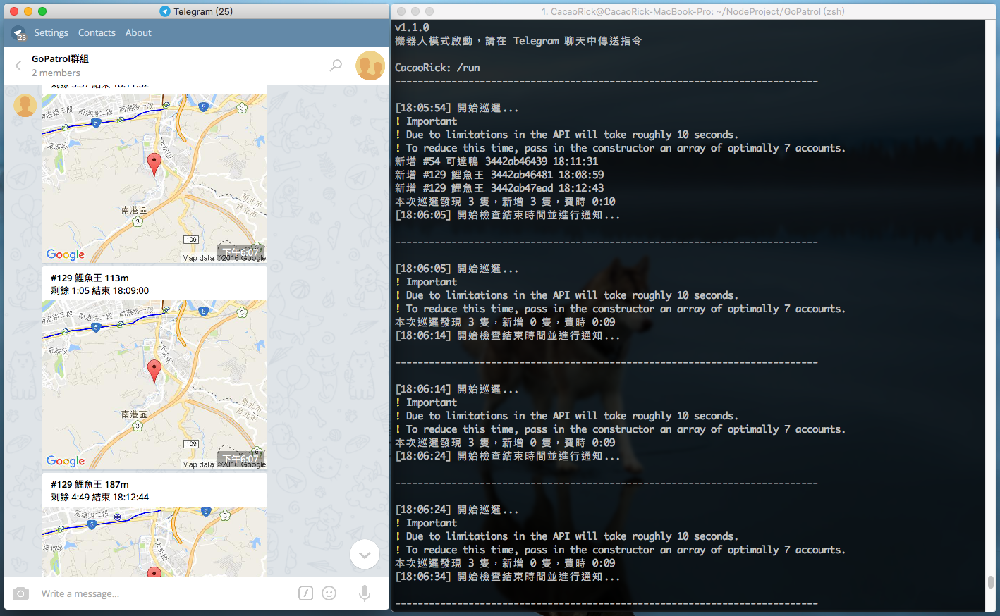
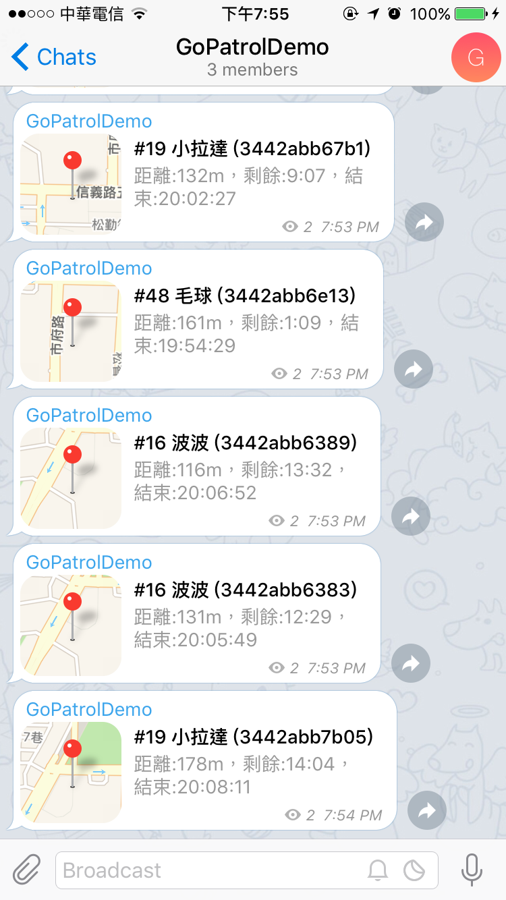

# GoPatrol
以指定的位置為中心進行巡邏尋找附近的寶可夢（範圍約半徑100多公尺），利用 Telegram bot 送出通知給使用者、頻道或群組。使用 [pokespotter](https://github.com/brentschooley/pokespotter) 與 [node-telegram-bot-api](https://github.com/yagop/node-telegram-bot-api) Node.js API 製作。

# 使用說明
需使用 [Node.js](https://nodejs.org/en/)
1. 安裝 `npm install gopatrol`
2. 複製一份 `example_config.js` 改名為 `config.js`
3. 編輯 `config.js`
4. 執行 `node index.js`
機器人模式時（`telegramChannelID` 為 `null` 時）需對機器人送出 `/start` 指令開始巡邏。

# 指令說明
限機器人模式使用（`telegramChannelID` 為 `null` 時）：

- `/help`：查看說明。
- `/start`：開始巡邏。
- `/stop`：停止巡邏。
- `/getmap`：取得附近寶可夢地圖。（尚未實做）
- 傳送位置訊息可更改巡邏中心位置（行動裝置版 Telegram）。（尚未實做）

# 截圖
Telegram Desktop

Telegram iOS APP

