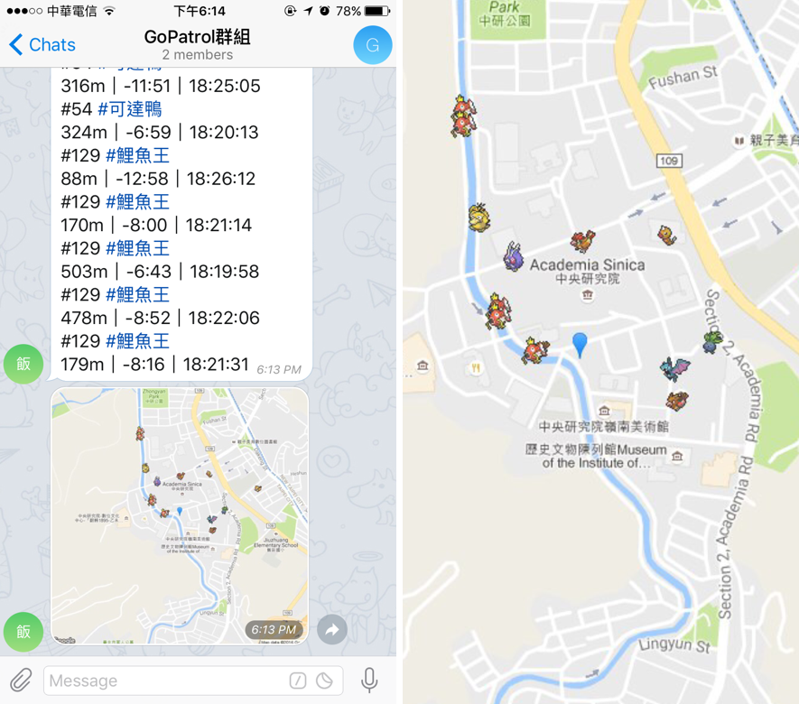

# GoPatrol

### 已停止維護，且目前版本因官方修改 API 而無法使用

以指定位置為中心進行巡邏，尋找附近的寶可夢並利用 Telegram bot 送出通知給使用者、頻道或群組。
本程式使用 [pokespotter](https://github.com/brentschooley/pokespotter) 與 [node-telegram-bot-api](https://github.com/yagop/node-telegram-bot-api) Node.js API 製作。

作者 Telegram [@CacaoRick](http://telegram.me/CacaoRick)，問題與討論請至 Telegram 群組[自己的廣播自己架](https://telegram.me/joinchat/DoTGVEFiQS0UGIg8atBTWw)。

## 使用說明與下載

<https://cacaorick.github.io/GoPatrol/>

## 截圖
Telegram Desktop

Telegram iOS APP

## 感謝
感謝`柯姊`提供 Icon host
感謝`Joseph Tsai` 提供部分程式碼
感謝[自己的廣播自己架](https://telegram.me/joinchat/DoTGVEFiQS0UGIg8atBTWw)的大家提供各種意見

### 更新內容

v1.1.2

- 更改異常時間的判斷方式

v1.1.1

- 修正錯字
- 照常顯示時間異常的寶可夢，將剩餘時間設為15分，並在剩餘時間與結束時間加上？標記
- 優化 `/getmap` 功能，在處理地圖的過程中，若同時有多人或多次使用`/getmap` 指令還是只會處理一次
- 讓部分指令能使用縮寫
    - `/help` -> `/h`
    - `/restart` -> `/re`
    - `/status` -> `/stat`
    - `/setsteps` -> `/step`
    - `/getmap` -> `/m`

v1.1.0

- 新增白名單功能，可跟黑名單擇一使用（另一個留空[ ]）
- 新增 `showDistance` 選項，某些大範圍廣播頻道不適合通知距離，可設為 `false` 將通知中的距離關閉
- 新增 `/setsteps <steps>` 指令，可用 Telegram 設定 `searchSteps`
- `/getmap` 改版，現在取回的地圖會有寶可夢的小ICON
- 巡邏結束後顯示費時
- 防止機器人接收伺服器啟動前的指令
- 已知API會提供剩餘時間異常的寶可夢，因此目前改為剩餘時間超過15分鐘的不通知
- 傳送位置訊息後會將現有的寶可夢資料清空
- 增強防呆能力

v1.0.2

- 新增 `debug` 選項，設為 `true` 可以印出更多資訊
- 修改 `autoRestartTime` 預設值為 0，設為 0 時不啟動卡住重啟功能
- 改善巡邏卡住重啟功能

v1.0.1

- 新增管理者功能
- 新增群組機器人功能
- 新增巡邏卡住自動重啟功能
- 修改設定檔時間單位為秒
- 刪除 `/start` 指令，改以 `/run` 取代，避免與機器人啟動指令衝突
- 新增 `/restart` 指令
- 新增 `/status` 指令
