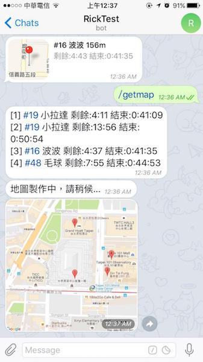

# GoPatrol
以指定的位置為中心進行巡邏尋找附近的寶可夢，利用 Telegram bot 送出通知給使用者、頻道或群組。使用 [pokespotter](https://github.com/brentschooley/pokespotter) 與 [node-telegram-bot-api](https://github.com/yagop/node-telegram-bot-api) Node.js API 製作。

# 使用說明
需先安裝 [Node.js 6.4.0↑](https://nodejs.org/en/)

1. 下載 zip 檔解壓縮（右上角綠色 Clone or downloa 按鈕 > Download ZIP），或是用 git clone
2. 使用 Node.js command prompt 或其他 Terminal 軟體，cd 到 GoPatrol 目錄下
2. 執行命令 `npm install` 安裝所需的 module
3. 將資料夾中的 `example_config.js` 複製一份改名為 `config.js`
4. 以文字編輯器開啟 `config.js` 編輯設定檔（建議使用[nodepad++](https://notepad-plus-plus.org/download/v6.9.2.html)等文字編輯器開啟）
5. 執行命令 `node index.js`

廣播頻道模式會自動開始巡邏。機器人模式需在聊天中送出 `/start` 指令以開始巡邏。

### 廣播頻道模式
將 `config.json` 中的 `telegramChannelID` 設為某個群組或頻道，程式會將找到的寶可夢廣播至該群組或頻道中。

### 機器人模式
將 `config.json` 中的 `telegramChannelID` 設為 `null`，將機器人加為好友，可在聊天中使用指令控制本程式。

# 指令說明
限機器人模式使用，對機器人送出以下指令來使用：

- `/help`：查看說明
- `/start`：開始巡邏
- `/stop`：停止巡邏
- `/getmap`：取得附近寶可夢地圖
- 傳送位置訊息可更改巡邏中心位置（行動裝置版 Telegram）

# 警告
用這個一定有被BAN的風險，使用前自己考慮要不要用，請勿使用主帳號登入！

# 截圖
Telegram Desktop

Telegram iOS APP

/getmap

