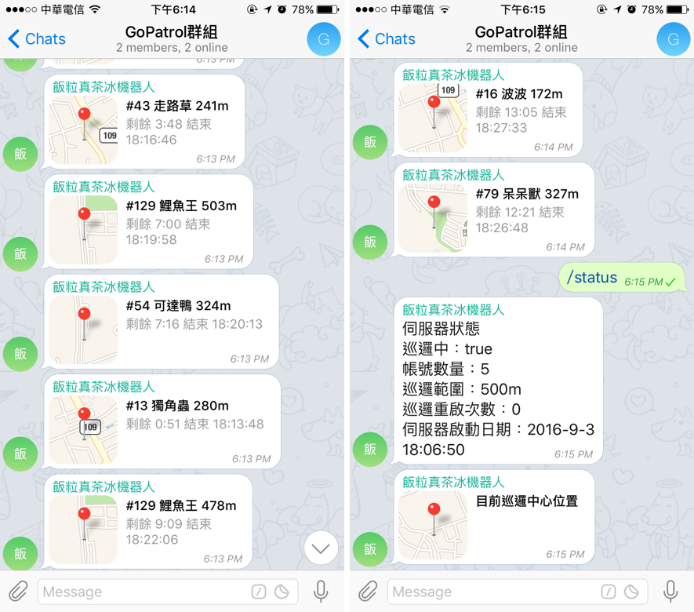

# GoPatrol
以指定位置為中心進行巡邏，尋找附近的寶可夢並利用 Telegram bot 送出通知給使用者、頻道或群組。
本程式使用 [pokespotter](https://github.com/brentschooley/pokespotter) 與 [node-telegram-bot-api](https://github.com/yagop/node-telegram-bot-api) Node.js API 製作。

作者 Telegram [@CacaoRick](http://telegram.me/CacaoRick)，問題與討論請至 Telegram 群組[自己的廣播自己架](https://telegram.me/joinchat/DoTGVEFiQS0UGIg8atBTWw)。

## 下載

目前最新版本為 v1.0.1b

[Windows X64](https://github.com/CacaoRick/GoPatrol/releases/download/v1.0.1b/GoPatrol-win-x64.zip)

[Mac OSX](https://github.com/CacaoRick/GoPatrol/releases/download/v1.0.1b/GoPatrol-mac.zip)

## 目錄

- [啟動伺服器](https://github.com/CacaoRick/GoPatrol#啟動伺服器)
- [機器人指令說明](https://github.com/CacaoRick/GoPatrol#機器人指令說明)
- [建立 Telegram 機器人](https://github.com/CacaoRick/GoPatrol#建立-telegram-機器人)
- [使用廣播頻道模式](https://github.com/CacaoRick/GoPatrol#使用廣播頻道模式)
- [使用機器人模式](https://github.com/CacaoRick/GoPatrol#使用機器人模式)
- [使用群組機器人模式](https://github.com/CacaoRick/GoPatrol#使用群組機器人模式)

## 啟動伺服器
1. 到 [Release](https://github.com/CacaoRick/GoPatrol/releases) 頁面根據作業系統下載對應的 zip 檔
2. 解壓縮後將資料夾中的 `example_config.js` 複製一份改名為 `config.js`
4. 以文字編輯器開啟 `config.js` 編輯設定檔（建議使用[nodepad++](https://notepad-plus-plus.org/download/v6.9.2.html)等文字編輯器開啟）
5. 點兩下資料夾中的 `start.bat` 或 `start.command`

## 機器人指令說明

- `/help` 查看說明
- `/getmap` 取得附近寶可夢地圖

以下指令限管理員使用：

- `/run` 開始巡邏和通知
- `/stop` 停止巡邏和通知
- `/restart` 強制重啟巡邏
- `/status` 取得伺服器狀態
- 傳送位置訊息可更改巡邏中心位置（行動裝置版 Telegram）

## 建立 Telegram 機器人
1. 在 Telegram 中搜尋 `@BotFather`
2. 用 `/newbot` 建立機器人
3. 輸入機器人名稱（例如 公司GoPatrol）
4. 輸入機器人使用者名稱，限英文且結尾須為 `bot`（例如 GoPatrol123_bot）
5. 將 BotFather 給你的 token 複製貼到 `config.js` 中的 `telegramBotToken`

## 使用廣播頻道模式
程式單純的將找到的寶可夢廣播至該頻道中，沒有指令功能。

1. 在 Telegram 建立頻道 (New Channel)
2. 需選擇公開頻道 (Public Channel)，並設定頻道連結，請記住你設定的連結，他就是你的頻道ID

2. 將你的機器人邀請為頻道管理員

3. 在 `config.js` 中將你的頻道ID前面加上`@`填入 `telegramChannelID`

## 使用機器人模式
可對機器人下指令來操控伺服器，發現寶可夢時會通知到與機器人的聊天對話中。

1. 將機器人加為好友
2. 將 `config.json` 中的 `telegramAdminUsernames` 填入你的使用者名稱(username)
3. 將 `config.json` 中的 `telegramChannelID` 設為 `null`
4. 啟動伺服器後，在你與機器人的聊天中輸入 `/run` 就會開始巡邏和通知

## 使用群組機器人模式
將機器人邀請進入群組中，供大家一起使用，並且將發現的寶可夢通知到群組中。

1. 找 `@BotFather` 下達 `/setjoingroups` 指令
2. 選擇要加入群組的機器人並按下 `Enable`
3. 建立群組(New Group)，將機器人邀請加入群組中
4. 開啟群組的管理員設定，將 `All Members Are Admins` 取消勾選，並將你的機器人設為管理員

5. 將 `config.json` 中的 `telegramAdminUsernames` 填入你的使用者名稱(username)
6. 將 `config.json` 中的 `telegramChannelID` 設為 `null`
7. 啟動伺服器後，在群組中輸入 `/run` 就會開始巡邏和通知

## 警告
用這個一定有被BAN的風險，使用前自己考慮要不要用，請勿使用主帳號登入！

## 截圖
Telegram Desktop

Telegram iOS APP

